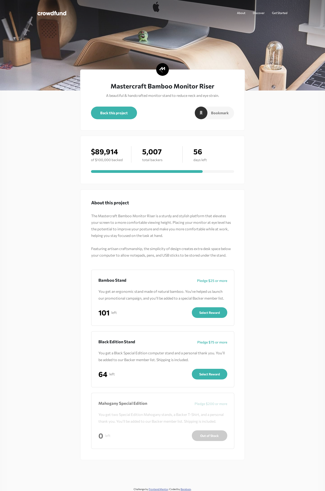
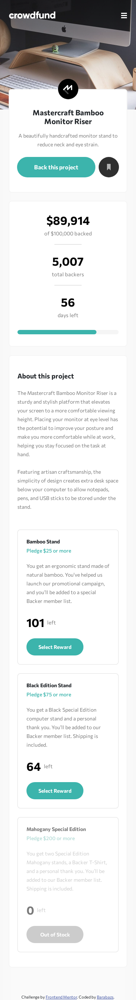

# Frontend Mentor - Crowdfunding product page solution

This is a solution to the [Crowdfunding product page challenge on Frontend Mentor](https://www.frontendmentor.io/challenges/crowdfunding-product-page-7uvcZe7ZR). Frontend Mentor challenges help you improve your coding skills by building realistic projects. 

## Table of contents

- [Frontend Mentor - Crowdfunding product page solution](#frontend-mentor---crowdfunding-product-page-solution)
  - [Table of contents](#table-of-contents)
  - [Overview](#overview)
    - [The challenge](#the-challenge)
    - [Screenshots](#screenshots)
    - [Links](#links)
  - [My process](#my-process)
    - [Built with](#built-with)
    - [Personal note](#personal-note)
  - [Author](#author)

**Note: Delete this note and update the table of contents based on what sections you keep.**

## Overview

### The challenge

Users should be able to:

- View the optimal layout depending on their device's screen size
- See hover states for interactive elements
- Make a selection of which pledge to make
- See an updated progress bar and total money raised based on their pledge total after confirming a pledge
- See the number of total backers increment by one after confirming a pledge
- Toggle whether or not the product is bookmarked

### Screenshots

 

### Links
- [Source Code](https://github.com/Barabazs/frontendmentor/tree/main/crowdfunding-product-page)
- [Live site](https://barabazs.github.io/frontendmentor/pricrowdfunding-product-page/)
<!-- - [Frontend Mentor Submission](https://www.frontendmentor.io/solutions/?????) -->

## My process

### Built with

- Semantic HTML5 markup
- CSS custom properties
- Flexbox
- Bootstrap 5
- CSS Grid
- Mobile-first workflow
- Javascript

### Personal note
I have tried to approximate the lay-out as much as possible for the specified widths, but took some liberties for larger screens. E.g. blurred background for the top image.

## Author

- Github - [Barabazs](https://github.com/Barabazs)
- Frontend Mentor - [@Barabazs](https://www.frontendmentor.io/profile/Barabazs)
