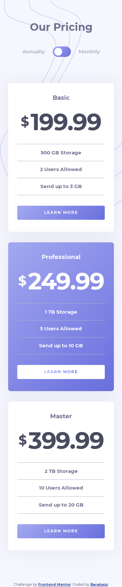

# Frontend Mentor - Pricing component with toggle solution

This is a solution to the [Pricing component with toggle challenge on Frontend Mentor](https://www.frontendmentor.io/challenges/pricing-component-with-toggle-8vPwRMIC). Frontend Mentor challenges help you improve your coding skills by building realistic projects. 

## Table of contents

- [Frontend Mentor - Pricing component with toggle solution](#frontend-mentor---pricing-component-with-toggle-solution)
  - [Table of contents](#table-of-contents)
  - [Overview](#overview)
    - [The challenge](#the-challenge)
    - [Screenshots](#screenshots)
    - [Links](#links)
  - [My process](#my-process)
    - [Built with](#built-with)
    - [Personal note](#personal-note)
  - [Author](#author)

## Overview

### The challenge

Users should be able to:

- View the optimal layout for the component depending on their device's screen size
- Control the toggle with both their mouse/trackpad and their keyboard
- **Bonus**: Complete the challenge with just HTML and CSS

### Screenshots
 

### Links
- [Source Code](https://github.com/Barabazs/frontendmentor/tree/main/pricing-component-with-toggle)
- [Live site](https://barabazs.github.io/frontendmentor/pricing-component-with-toggle/)
- [Frontend Mentor Submission](https://www.frontendmentor.io/solutions/a-bit-of-bootstrap5-but-mostly-vanilla-css-6i5Spvm8N)

## My process

### Built with

- Semantic HTML5 markup
- CSS custom properties
- Flexbox
- Bootstrap 5
- CSS Grid
- Mobile-first workflow
- Javascript

### Personal note
I have tried to use more variables and calculations instead of using "magic numbers".

## Author

- Github - [Barabazs](https://github.com/Barabazs)
- Frontend Mentor - [@Barabazs](https://www.frontendmentor.io/profile/Barabazs)
